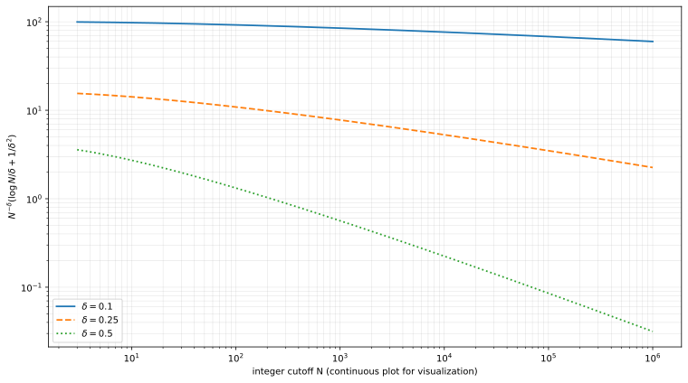

# Arithmetic side and prime cutoff

For real \(\sigma>1\),

\[
\frac{\xi'}{\xi}(\sigma)=
\frac1\sigma+\frac1{\sigma-1}-\frac12\log\pi
+\frac12\psi(\sigma/2)
-\sum_{n\ge2}\frac{\Lambda(n)}{n^\sigma}.
\]

Let \(y=\sqrt{x}\), \(\sigma=1/2+y\), and for an **integer** cutoff \(N\ge3\) replace the infinite von Mangoldt sum by \(2\le n\le N\). If \(\sigma\ge1+\delta\), then

\[
\sum_{n>N}\frac{\Lambda(n)}{n^\sigma}
\le N^{-\delta}\left(\frac{\log N}{\delta}+\frac1{\delta^2}\right).
\]

The integer hypothesis matters: the direct sum–integral comparison is stated at the last included integer. After division by \(2y\), it bounds the arithmetic truncation error uniformly on intervals bounded away from \(x=1/4\).

The Lean module currently proves nonnegativity of the closed form. Formalizing the full tail theorem requires compatible Mathlib results for the von Mangoldt bound, monotonicity, the discrete sum–integral comparison and integral evaluation.
