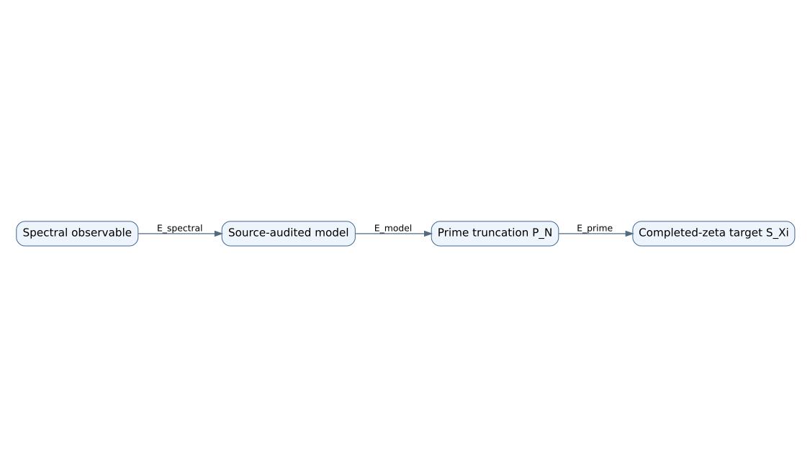
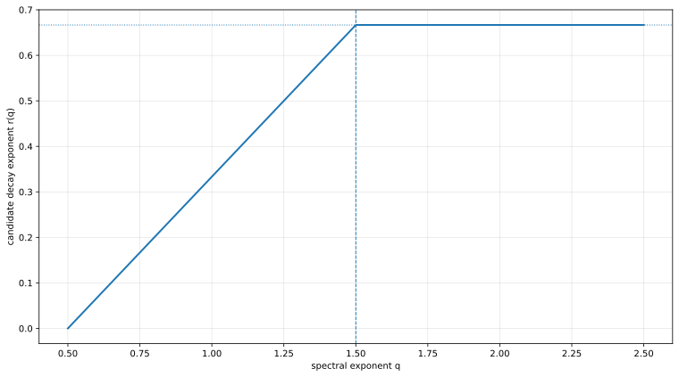

# Error budget and scalar rates

The central decomposition is

\[
|S_{\mathrm{spectral}}-\mathcal S_\Xi|
\le
|S_{\mathrm{spectral}}-S_{\mathrm{model}}|
+|S_{\mathrm{model}}-P_N|
+|P_N-\mathcal S_\Xi|.
\]

Each term has a different trust boundary:

1. **spectral:** Galerkin truncation, eigenstate alignment, domains and gaps;
2. **model:** normalization, transforms and transfer from the source model;
3. **prime:** explicit arithmetic cutoff.

The candidate scalar decay exponent

\[
r(q)=\min\left(\frac{2q-1}{3},\frac23\right)
\]

is positive for \(q>1/2\), saturates at \(2/3\) for \(q\ge3/2\), and never exceeds that ceiling. These scalar facts are checked in Lean; the hypothesis that a concrete spectral defect has exponent \(q>1/2\) is not.

