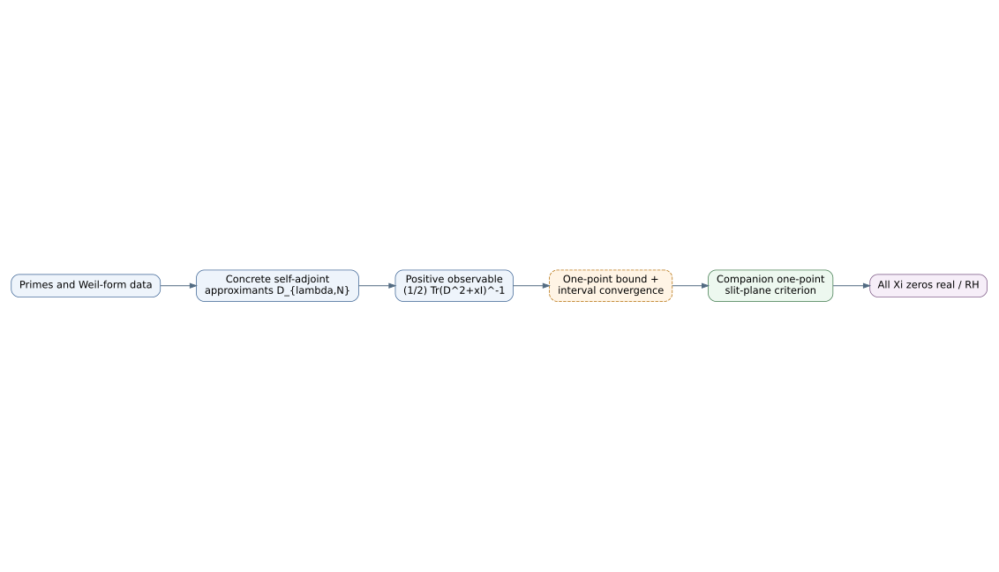

# Integrated prime–resolvent programme

## Purpose

Let

\[
\xi(s)=\frac12s(s-1)\pi^{-s/2}\Gamma(s/2)\zeta(s),
\qquad
\Xi(z)=\xi\!\left(\frac12+iz\right).
\]

RH is equivalent to all zeros of the even entire function \(\Xi\) being real. The programme seeks a positive scalar observable built from prime-dependent self-adjoint approximants rather than direct convergence of regularized determinants.

The canonical observable is

\[
S_D(x)=\frac12\operatorname{Tr}(D^2+xI)^{-1}.
\]

It damps high spectrum, is positive for self-adjoint \(D\), and naturally yields Stieltjes transforms.

## Dependency chain

The construction repository must prove the first arrow:

\[
S_j\longrightarrow \mathcal S_\Xi
\quad\text{on one real interval, with one-point compactness control.}
\]

The criterion subproject owns the second arrow from that convergence to RH.

## Source boundary

Prime-built finite-dimensional operators and model convergence are motivated by current spectral work, but the source literature itself identifies unresolved simplicity/evenness and state-alignment estimates. This repository treats them as open obligations. See the [source audit](../SOURCE-AUDIT-ARXIV-2511.22755.md).
