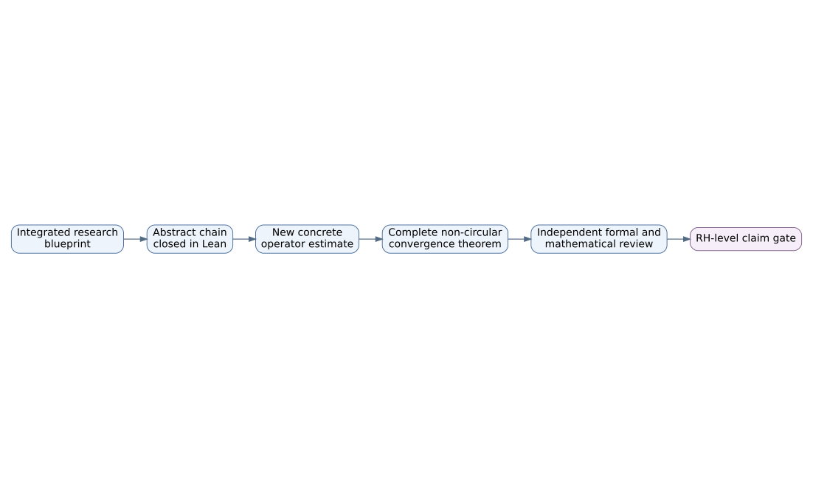

# Spectral construction frontier

For a concrete finite or Galerkin operator \(D_{\lambda,N}\), define

\[
S_{\lambda,N}(x)=\frac12\operatorname{Tr}
(D_{\lambda,N}^2+xI)^{-1}.
\]

The construction must establish, without RH:

- self-adjointness on an explicit domain;
- correct pairing and multiplicity normalization;
- positivity and finite/trace-class resolvent control;
- a uniform one-point bound;
- comparison with the source-audited model;
- a limit that survives the Galerkin and parameter cutoffs.

For a normalized trial vector \(v\), finite Rayleigh and residual estimates can certify proximity to an isolated eigenstate once a genuine gap or separation lower bound is known. Those deterministic implications are represented in Lean. Obtaining a uniform non-circular lower bound for the relevant concrete family is open.

