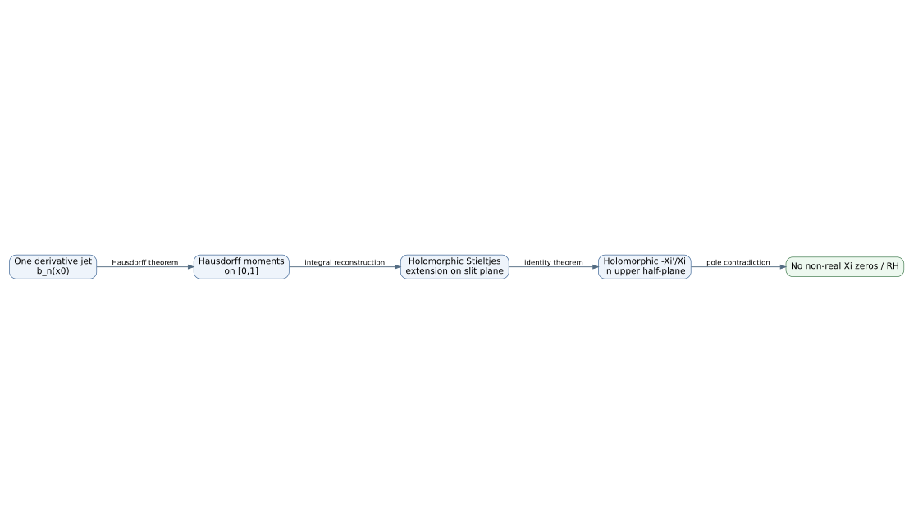

# One-Point Resolvent–Hausdorff Programme

This site is the canonical manuscript and technical documentation for the criterion repository.

## Central idea

At one fixed base point \(x_0>1/4\), encode the derivative jet of the completed-zeta resolvent target by

\[
b_n(x_0)=x_0^n\frac{(-1)^n}{n!}\mathcal S_\Xi^{(n)}(x_0).
\]

A Hausdorff representing measure on `[0,1]` reconstructs a holomorphic Stieltjes function on the slit plane. Agreement of its Taylor series with the target near \(x_0\) invokes the logarithmic-derivative pole argument and excludes non-real zeros of \(\Xi\).

## Read in this order

1. [Integrated manuscript](manuscript/index.md).
2. [Mathematical status](MATHEMATICAL_STATUS.md).
3. [Programme relationship](PROGRAMME_RELATION.md).
4. [Lean map](LEAN_MAP.md).
5. [Formal proof plan](FORMAL_PROOF_PLAN.md).
6. [Publication gate](PUBLICATION_GATE.md).

!!! warning "Claim boundary"
    The finite Lean layer is verified. The complete analytic equivalence is documented but still needs full Lean closure and independent specialist review. The concrete prime-built convergence theorem belongs to the companion repository and remains open.
