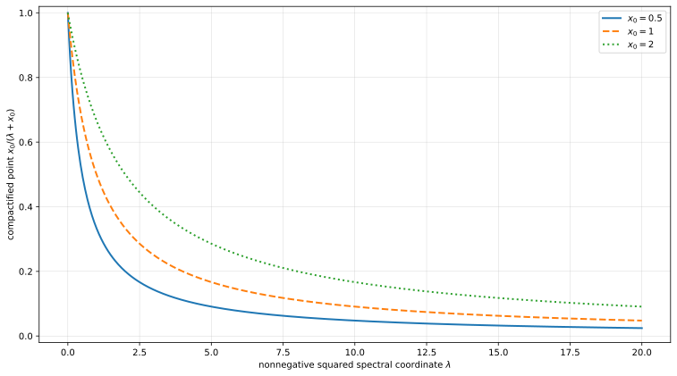
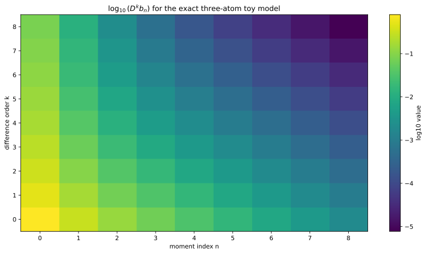

# Finite certificate hierarchies

## Exact finite atomic identity

For finite weights \(w_i\) and points \(p_i\), let

\[
b_n=\sum_iw_ip_i^n.
\]

Induction gives

\[
D^kb_n=\sum_iw_ip_i^n(1-p_i)^k.
\]

When \(w_i\ge0\) and \(0\le p_i\le1\), every term is nonnegative. This identity is the central verified theorem in `OnePointResolvent.HausdorffFinite`.

## Resolvent compactification

For \(x_0>0\) and finite squared spectrum \(\lambda_i\ge0\), set

\[
w_i=\frac1{\lambda_i+x_0},
\qquad
p_i=\frac{x_0}{\lambda_i+x_0}\in[0,1].
\]

The resulting finite resolvent moments are automatically Hausdorff-completely monotone.

## Hankel and localizing forms

For a moment sequence, define

\[
H_N=(b_{i+j})_{0\le i,j<N},
\qquad
L_N=(b_{i+j}-b_{i+j+1})_{0\le i,j<N}.
\]

For a coefficient vector \(c\), finite atoms give explicit sum-of-squares forms

\[
c^TH_Nc=\sum_aw_a\left(\sum_ic_ip_a^i\right)^2\ge0,
\]

\[
c^TL_Nc=\sum_aw_a(1-p_a)
\left(\sum_ic_ip_a^i\right)^2\ge0.
\]

The Lean source proves these formulas at the certificate level rather than relying on floating-point eigenvalues.

